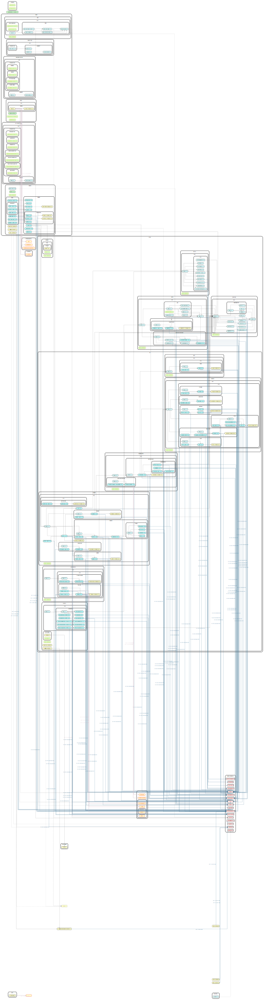

# Wα [w-al-fu] Web (v0beta1)

Wα is a proof of concept implementation of a polyglot monorepo workspace for micro frontends.

This project has two goals:

1. Provide a production-ready website. blog, and knowledge space for our corporate overlords
2. Act as a smoke test of the progress for an internal Platform as a Service (PaaS) product we are developing

## Features

[x] Opinionated workspace setup for micro frontend development with Nx, Nextjs, and Vercel.
[x] Modern best-practices workflow with linting, unit/e2e testing, and blue/green deployments managed by our internal Cloud-Native DevOps™ platform.
[x] Integrated pipeline using both GitHub Actions and GitLab CI in the same pipeline.
[ ] Tekton plugin to replicate internal cluster operator

## Dependency Graph

