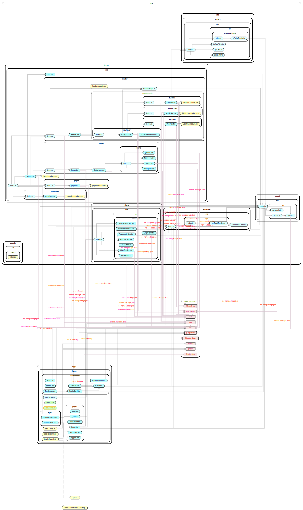
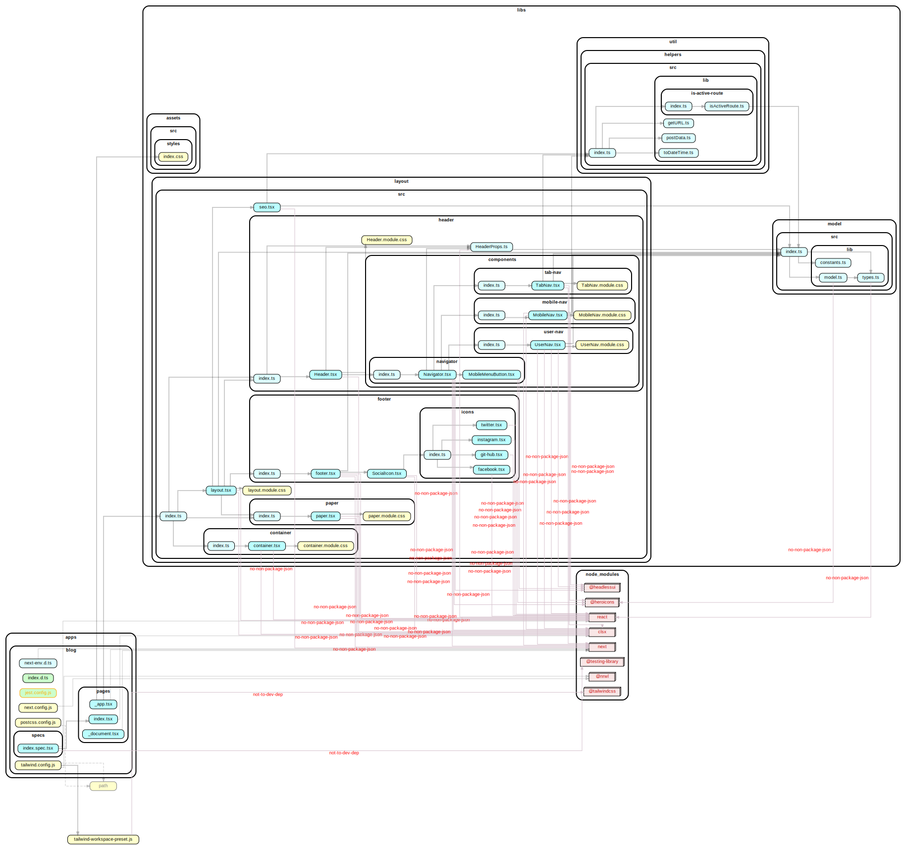

# Wα [w-al-fu] Web (v0beta1)

Wα is a proof of concept implementation of a polyglot monorepo workspace for micro frontends.

This project has two goals:

1. Provide a production-ready website. blog, and knowledge space for our corporate overlords
2. Act as a smoke test of the progress for an internal Platform as a Service (PaaS) product we are developing

## Home

## Blog

